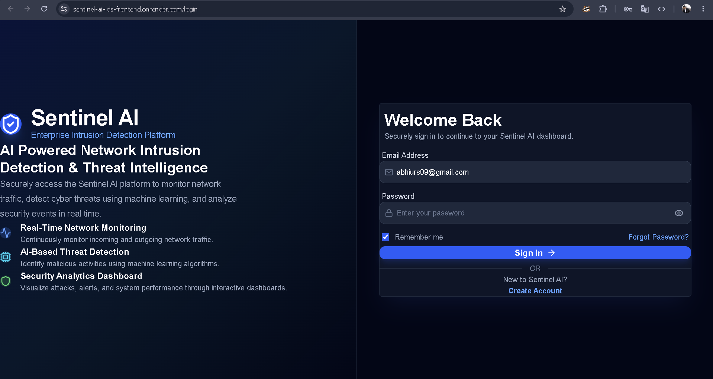
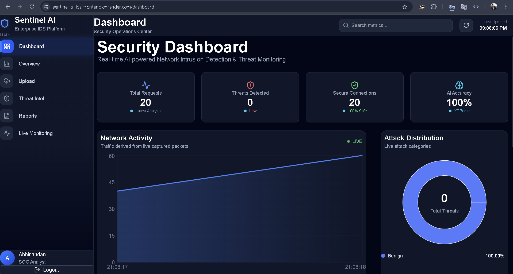
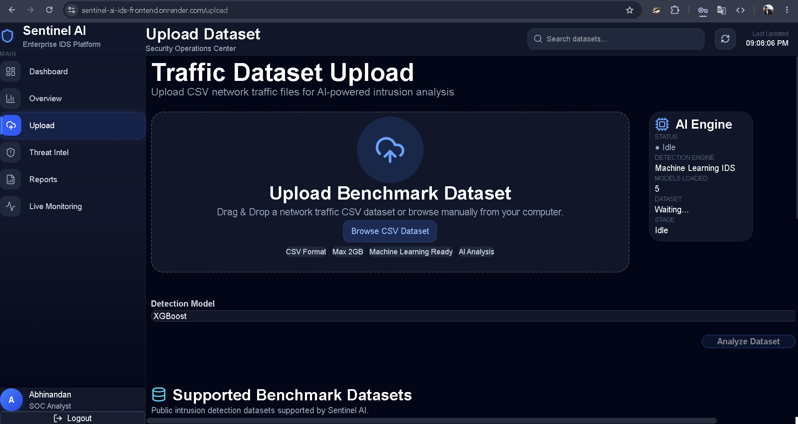
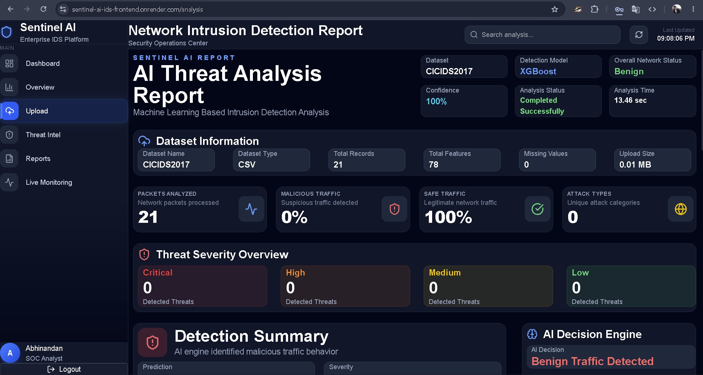
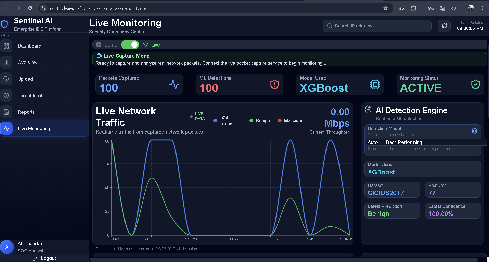
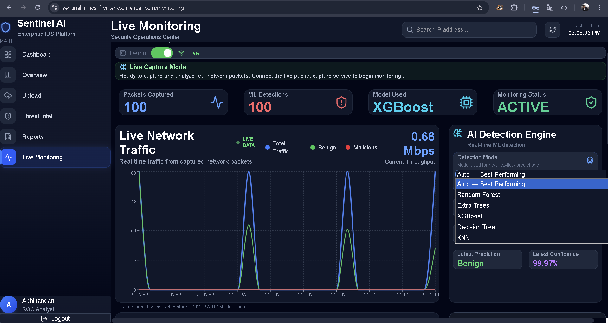
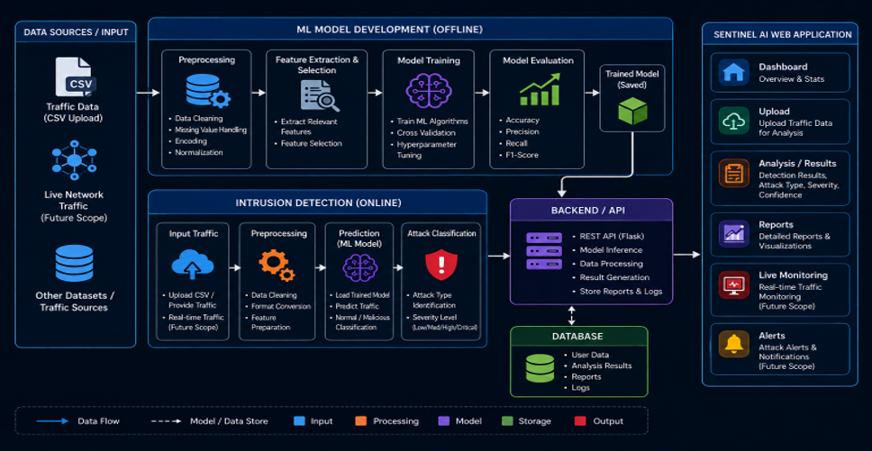

# Sentinel AI IDS

## AI-Driven Network Intrusion Detection System Using Machine Learning

Sentinel AI IDS is an AI-driven Network Intrusion Detection System (NIDS) designed to detect and analyze malicious network activities using machine learning techniques.

The system combines a React-based web dashboard, Flask REST API backend, MongoDB database, machine learning models, and a Windows-based local network sensor to provide both **CSV-based network traffic analysis** and **real-time network monitoring**.

The primary objective of Sentinel AI IDS is to provide an intelligent, practical, and user-friendly platform for detecting suspicious network activities and analyzing intrusion patterns.

---

---

# 🌐 Live Deployment

### 🚀 Live Application

**Frontend:**  
https://sentinel-ai-ids-frontend.onrender.com

### ⚙️ Backend API

**Backend:**  
https://sentinel-ai-ids-backend.onrender.com

> The frontend provides the complete Sentinel AI IDS web application. The backend provides the REST API, authentication, machine learning prediction services, and live monitoring APIs.

---

## 🚀 Key Features

### 🔐 Secure User Authentication

- User registration and login
- JWT-based authentication
- Password hashing
- Protected API endpoints
- Token-based authorization
- Environment-based secret configuration

### 🤖 AI-Based Intrusion Detection

Sentinel AI IDS supports multiple machine learning algorithms:

- Random Forest
- Extra Trees
- XGBoost
- Decision Tree
- KNN

The system also provides an **Auto** mode, where XGBoost is used as the default model.

### 📁 CSV-Based Network Traffic Analysis

Users can upload network traffic datasets in CSV format.

The system processes the uploaded data through the machine learning pipeline and generates intrusion detection results.

Workflow:
```
CSV Upload
    ↓
Data Processing
    ↓
Feature Extraction / Preprocessing
    ↓
ML Model
    ↓
Prediction
    ↓
Detection Results
    ↓
Dashboard
```

# 🌐 Live Network Monitoring
Sentinel AI IDS provides a Windows-based local sensor for monitoring live network traffic.
The live monitoring pipeline uses:
- Scapy for packet capture
- Network feature extraction
- Machine learning prediction
- Secure backend communication
- React live dashboard

Architecture:
```
Windows Network Traffic
        ↓
Local Sensor Agent
        ↓
Scapy Packet Capture
        ↓
Feature Extraction
        ↓
Machine Learning Model
        ↓
Detection Result
        ↓
HTTPS Backend API
        ↓
React Dashboard
```

# 🎛️ Dynamic ML Model Selection
The Live Monitoring dashboard allows users to select the model dynamically:
Auto
Random Forest
Extra Trees
XGBoost
Decision Tree
KNN

The selected model is synchronized between the web dashboard and the local sensor.
When Auto is selected:
Auto → XGBoost

# 📊 Monitoring Dashboard
The dashboard provides information such as:
- Captured packets
- Network activity
- Intrusion detections
- Model currently in use
- Selected ML model
- Dataset information
- Recent detection information
- Live monitoring status
- System statistics


# 🖥️ Portable Windows Sensor Setup
The repository includes:
setup_sensor_agent.ps1

This PowerShell script provides a one-time automated setup for the Windows Local Sensor Agent.
The script can:
- Detect the project directory automatically
- Create the Python virtual environment if required
- Install Python dependencies
- Check Scapy availability
- Check Npcap availability
- Configure the local environment
- Register the Local Sensor Agent with Windows Task Scheduler
- Start the sensor agent
- Verify the local sensor endpoint
The setup does not depend on a fixed Windows username or installation directory.

# ⚙️ Automatic Sensor Startup
The Local Sensor Agent is registered with Windows Task Scheduler.

After Windows login:
```
Windows Login
     ↓
Local Sensor Agent Starts
     ↓
Packet Capture OFF
     ↓
Wait for Live Monitoring
```
The sensor does not continuously capture network traffic when the agent starts.

When the user switches:
Demo → Live

the local packet capture starts.

When the user switches:
Live → Demo

the local packet capture stops.

# 🖥️ Application Screenshots

## 🔐 Login



## 📊 Security Dashboard



## 📁 Network Traffic Analysis



## 🚨 Intrusion Detection Results



## 🌐 Real-Time Live Monitoring



## 🤖 Machine Learning Model Selection



## 🏗️ System Architecture




# 🧠 Machine Learning
Sentinel AI IDS uses supervised machine learning techniques for network intrusion detection.
Supported Algorithms
```
Algorithm	                Description
Random Forest	    Ensemble tree-based classification
Extra Trees	      Randomized ensemble classification
XGBoost	          Gradient boosting classification
Decision Tree	    Tree-based classification
KNN	              Distance-based classification
```

Auto Mode
The system provides an automatic model selection mode.
Auto
  ↓
XGBoost

XGBoost is currently used as the default model for Auto mode.

# 📚 Datasets
The project has been evaluated using multiple network intrusion detection datasets.

CICIDS2017
CICIDS2017 is the primary dataset used for the live monitoring pipeline.
- Dataset: CICIDS2017
- Features: 77
- Used for machine learning training and evaluation
- Used by the live detection pipeline

CSE-CIC-IDS2018
Used for additional machine learning model evaluation and comparison.

NSL-KDD
Used for evaluating the models against a widely used network intrusion detection benchmark.

UNSW-NB15
Used for evaluating model performance on modern network traffic data.

# 📊 Model Performance
The following results were obtained during the project's experimental evaluation.
```
Dataset	                        Best Performing                 Model	Accuracy
CICIDS2017	                      XGBoost	                         99.89%
CSE-CIC-IDS2018	      XGBoost / Decision Tree / Random Forest	    100.00%
NSL-KDD	                          XGBoost	                         99.70%
UNSW-NB15	                        XGBoost	                         90.79%
```

Performance may vary depending on preprocessing, dataset version, feature selection, training configuration, and execution environment.

# CICIDS2017 Model Comparison
```
Model	            Accuracy
XGBoost	           99.89%
Decision Tree	     99.86%
Random Forest	     99.85%
Extra Trees	       99.70%
KNN	               99.41%
```
# 🏗️ System Architecture

                         ┌─────────────────────┐
                         │        User         │
                         └──────────┬──────────┘
                                    │
                                    ▼
                         ┌─────────────────────┐
                         │   React Frontend    │
                         │    Web Dashboard    │
                         └──────────┬──────────┘
                                    │ HTTPS
                                    ▼
                         ┌─────────────────────┐
                         │   Flask Backend     │
                         │      REST API       │
                         └──────┬───────┬──────┘
                                │       │
                    ┌───────────┘       └────────────┐
                    ▼                                ▼
             ┌──────────────┐              ┌────────────────┐
             │   MongoDB    │              │ ML Prediction  │
             │    Atlas     │              │    Pipeline    │
             └──────────────┘              └───────┬────────┘
                                                    │
                                                    ▼
                                            ┌───────────────┐
                                            │   Detection   │
                                            │    Results    │
                                            └───────────────┘


                     LIVE MONITORING PIPELINE

                 Windows Network Traffic
                            │
                            ▼
                 ┌────────────────────┐
                 │ Local Sensor Agent │
                 └─────────┬──────────┘
                           │
                           ▼
                    Scapy Capture
                           │
                           ▼
                  Feature Extraction
                           │
                           ▼
                    ML Prediction
                           │
                           ▼
                  HTTPS Ingestion
                           │
                           ▼
                   Flask Backend
                           │
                           ▼
                  React Live Dashboard


# 🛠️ Technology Stack
Frontend
- React
- Vite
- JavaScript
- Tailwind CSS
- Axios
- Chart.js
Backend
- Python
- Flask
- Flask-CORS
- REST API
- JWT Authentication
Machine Learning
- Scikit-learn
- XGBoost
- NumPy
- Pandas
- Joblib
Network Monitoring
- Scapy
- Npcap
- Python
Database
- MongoDB
- MongoDB Atlas
Deployment
- Render
- GitHub
Development Tools
- Visual Studio Code
- Git
- GitHub
- Windows PowerShell

# 📂 Project Structure

```text
sentinel-ai-ids/
│
├── backend/
│   ├── database/
│   ├── logs/
│   ├── ml/
│   ├── models/
│   ├── preprocess/
│   ├── reports/
│   ├── routes/
│   ├── schemas/
│   ├── services/
│   ├── static/
│   ├── uploads/
│   ├── utils/
│   ├── .env.example
│   ├── .gitignore
│   ├── .python-version
│   ├── app.py
│   ├── config.py
│   ├── query
│   ├── requirements.txt
│   ├── test_jwt.py
│   └── test_password.py
│
├── client/
│   ├── dist/
│   ├── public/
│   ├── src/
│   ├── .env.example
│   ├── .gitignore
│   ├── eslint.config.js
│   ├── index.html
│   ├── package-lock.json
│   ├── package.json
│   ├── README.md
│   └── vite.config.js
│
├── dataset/
│
├── docs/
│
├── ml-api/
│
├── server/
│
├── .gitattributes
├── .gitignore
├── README.md
└── setup_sensor_agent.ps1
```

# ⚙️ Installation
Prerequisites
Before installing Sentinel AI IDS, make sure the following are available:
- Windows 10/11
- Python 3.x
- Node.js and npm
- Git
- Npcap
- MongoDB Atlas account
- Internet connection
For Live Monitoring, Npcap should be installed with WinPcap-compatible support.

# 📥 Clone the Repository
git clone https://github.com/abhiurs/sentinel-ai-ids.git

cd sentinel-ai-ids

## 🐍 Backend Setup
Create a Python virtual environment:

python -m venv .venv

Activate the virtual environment:

.venv\Scripts\activate

Install the backend dependencies:

pip install -r backend\requirements.txt

# 🔐 Environment Configuration
Create the following file:

backend/.env

Use the following structure:

SECRET_KEY=your-secret-key

JWT_SECRET_KEY=your-jwt-secret

MONGO_URI=your-mongodb-connection-string

DATABASE_NAME=your-database-name

FRONTEND_URL=your-frontend-url

LIVE_SENSOR_API_URL=your-backend-url

LIVE_SENSOR_KEY=your-live-sensor-key

Never commit the actual .env file to GitHub.
Use:

backend/.env.example

as a safe configuration template.
▶️ Running the Backend
From the project root:
.venv\Scripts\activate
python backend\app.py

The backend runs on:
http://127.0.0.1:5000

## 💻 Running the Frontend
Navigate to the client directory:
cd client

Install dependencies:
npm install

Configure the frontend environment:
VITE_API_URL=http://127.0.0.1:5000/api

Start the development server:
npm run dev

The frontend will normally be available at:
http://localhost:5173

## 🌐 Portable Live Sensor Setup
Sentinel AI IDS includes an automated Windows setup script.
Open PowerShell as Administrator from the project root.
Temporarily allow PowerShell script execution:
Set-ExecutionPolicy -Scope Process -ExecutionPolicy Bypass

Run the setup:
.\setup_sensor_agent.ps1

The setup script automatically:
1. Detects the Sentinel AI project directory.
2. Checks the Python environment.
3. Creates .venv if required.
4. Installs Python dependencies.
5. Checks Scapy.
6. Checks Npcap.
7. Configures backend/.env.
8. Registers the Local Sensor Agent in Windows Task Scheduler.
9. Starts the Local Sensor Agent.
10. Verifies the local agent endpoint.
After setup, the local agent is available at:
http://127.0.0.1:8765/

# 📡 Live Monitoring Workflow
The live monitoring process works as follows:
```
1. Windows starts
        ↓
2. Local Sensor Agent starts automatically
        ↓
3. Packet capture remains OFF
        ↓
4. User opens Sentinel AI
        ↓
5. User opens Live Monitoring
        ↓
6. Demo → Live
        ↓
7. Local packet capture starts
        ↓
8. Network packets are captured
        ↓
9. Network features are extracted
        ↓
10. ML model performs prediction
        ↓
11. Detection results are sent to backend
        ↓
12. Dashboard displays live results
```
When the user switches:
Live → Demo

the local sensor stops packet capture.

# 🎛️ Live Model Selection
The Live Monitoring page allows dynamic model selection.
Available models:
Auto
Random Forest
Extra Trees
XGBoost
Decision Tree
KNN

The workflow is:
```
React Dashboard
       ↓
Model Selection
       ↓
Flask Backend
       ↓
Local Sensor Agent
       ↓
ML Model
       ↓
Live Prediction
```
For Auto mode:
Auto → XGBoost

# 🔒 Security Features
Sentinel AI IDS incorporates several security mechanisms:
- JWT-based authentication
- Password hashing
- Protected API routes
- Input validation
- CORS configuration
- Environment-based secrets
- Dedicated live sensor authentication key
- HTTPS communication between the sensor and deployed backend
- Secrets excluded from GitHub
- Local sensor restricted to 127.0.0.1
The local sensor authenticates its communication with the backend using:
X-Live-Sensor-Key

# 🧪 Testing
The deployed system has been tested across the major production workflows.
Test Case	Description	Status

TC01  	Refresh deployed application	✅ Pass

TC02  	User login	✅ Pass

TC03  	Open Live Monitoring	✅ Pass

TC04  	Start Live Mode	✅ Pass

TC05  	Verify packets increase	✅ Pass

TC06  	Test ML model selection	✅ Pass

TC07  	Verify model displayed on dashboard	✅ Pass

TC08  	Live → Demo transition	✅ Pass

TC09  	Verify sensor stops	✅ Pass

TC10  	Demo → Live transition	✅ Pass

TC11  	Verify sensor restarts and packets return	✅ Pass


# ☁️ Deployment Architecture
The deployed system uses a distributed architecture:
```
                    ┌──────────────────────┐
                    │      User Browser    │
                    └──────────┬───────────┘
                               │
                               ▼
                    ┌──────────────────────┐
                    │    React Frontend    │
                    │       Render         │
                    └──────────┬───────────┘
                               │ HTTPS
                               ▼
                    ┌──────────────────────┐
                    │    Flask Backend     │
                    │       Render         │
                    └──────────┬───────────┘
                               │
                               ▼
                    ┌──────────────────────┐
                    │     MongoDB Atlas    │
                    └──────────────────────┘


                    LOCAL LIVE SENSOR

                    Windows Machine
                           │
                           ▼
                 ┌──────────────────────┐
                 │   Local Sensor Agent │
                 │   Scapy + ML Models  │
                 └──────────┬───────────┘
                            │ HTTPS
                            ▼
                 ┌──────────────────────┐
                 │    Flask Backend     │
                 │       Render         │
                 └──────────┬───────────┘
                            │
                            ▼
                 ┌──────────────────────┐
                 │    React Dashboard   │
                 └──────────────────────┘
```

# 🎯 Project Objectives
The main objectives of Sentinel AI IDS are:
1. Detect malicious network activities using machine learning.
2. Provide a web-based network intrusion detection dashboard.
3. Support multiple machine learning algorithms.
4. Analyze uploaded network traffic datasets.
5. Provide real-time network traffic monitoring.
6. Synchronize model selection between the dashboard and local sensor.
7. Provide a portable Windows sensor deployment mechanism.
8. Demonstrate practical application of AI and machine learning in cybersecurity.

# 🔮 Future Enhancements
Potential future improvements include:
- Advanced anomaly detection
- Threat intelligence integration
- SIEM integration
- Automated email and notification alerts
- Role-based access control
- Additional intrusion detection datasets
- Deep learning-based detection
- Automated incident response
- Advanced attack correlation
- Multi-device sensor deployment
- Centralized security monitoring
- Containerized deployment
- Improved real-time event streaming

# ⚠️ Limitations
The current implementation has the following limitations:
- Live packet capture is currently designed for Windows environments.
- Npcap is required for live packet capture.
- The local sensor must run on the machine whose traffic is being monitored.
- Live monitoring requires connectivity with the deployed backend.
- The remote live store is intended for the live monitoring workflow rather than permanent packet storage.

# 👨‍💻 Project Information
Project Name: Sentinel AI IDS

Project Type: Final Year Computer Science Engineering Project

Domain: Cybersecurity / Network Security / Machine Learning

Core Area: AI-Driven Network Intrusion Detection

Primary Dataset: CICIDS2017

Primary ML Model: XGBoost

Frontend: React

Backend: Flask

Database: MongoDB

Live Monitoring: Scapy + Windows Local Sensor

Deployment: Render


# 👤 Author
ABHINANDAN RAJE URS M.B.


# 📜 License
This project was developed for academic and educational purposes.
The project may be used for learning, research, and educational purposes with appropriate attribution.

# ⭐ Acknowledgements
This project was developed as an academic cybersecurity project focused on applying machine learning techniques to network intrusion detection and practical security monitoring.
The project makes use of open-source technologies, machine learning libraries, network monitoring tools, benchmark intrusion detection datasets, and cybersecurity research.

# ⭐ Support the Project
If you find Sentinel AI IDS useful or interesting, consider giving the repository a ⭐ on GitHub.
